# Ideal Fluid Flow via the Schwarz-Christoffel Transformation

**Complex Variables and Applications - Spring 2026**  
Congyuan Zheng · Sophia Arany · Alexander Ingalls  
University of Colorado Boulder, Department of Applied Mathematics

---

## Overview

This project applies the **Schwarz-Christoffel (SC) conformal mapping** to simulate
steady, irrotational, incompressible fluid flow inside the Boulder, Colorado city
boundary polygon. Four progressively richer physical models are implemented:

| Model | Potential $W(\zeta)$ | Physical meaning |
|-------|----------------------|-----------------|
| Uniform flow | $U\zeta$ | Ideal parallel flow |
| Terrain-corrected | $U\zeta + \sum_k q_k \log(\zeta - s_k)$ | Slope-driven sources/sinks from real DEM data |
| Urban obstacle | $U\zeta + \frac{Ua^2}{\zeta - \zeta_0} + \frac{Ua^2}{\bar\zeta - \bar\zeta_0}$ | Circle-theorem no-penetration obstacle |
| Road-vortex | $U\zeta + \sum_k \frac{-i\Gamma_k}{2\pi}[\log(\zeta-s_k)+\log(\zeta-\bar s_k)]$ | Point vortices at OSM road intersections |

The SC map $f : \mathbb{H} \to \Omega$ sends the upper half-plane to the Boulder polygon,
converting analytically tractable potentials in $\mathbb{H}$ into streamlines and
equipotentials in the physical domain.

---

## Mathematical Framework

### Schwarz-Christoffel Mapping

For a polygon with $n$ vertices and interior angles $\alpha_k\pi$, the SC map from $\mathbb{H}$ to $\Omega$ is

$$f(\zeta) = A + C \int_{\zeta_0}^{\zeta} \prod_{k} (t - \zeta_k)^{\alpha_k - 1} \, dt$$

The **pre-vertices** $\zeta_k \in \mathbb{R}$ are unknowns. Möbius normalisation fixes three
($\zeta_0 = -1$, $\zeta_1 = 0$, $\zeta_{n-1} = 1$); the rest are found by Levenberg-Marquardt
nonlinear least-squares matching edge-length ratios of the mapped polygon to the target.

Streamlines are computed via the **forward map**: horizontal lines $\text{Im}(\zeta) = y_0$
in $\mathbb{H}$ are mapped forward as parametric curves $z(t) = f(t + iy_0)$, giving
exact artifact-free streamlines with no inverse-solver required.

### Terrain Correction

Elevation data (USGS 3DEP, 81 points) is fitted with a thin-plate-spline RBF. Each polygon
vertex $k$ contributes a source/sink pair in $\mathbb{H}$:

$$W_\text{terrain}(\zeta) = U\zeta + \sum_k \frac{q_k}{2\pi}
  \Bigl[\log(\zeta - s_k) + \log(\zeta - \bar{s}_k)\Bigr]$$

The image term $\log(\zeta - \bar{s}_k)$ enforces $\psi = 0$ on $\mathbb{R}$ by the
method of images, since $\text{Im}[\log(\zeta - s_k) + \log(\zeta - \bar{s}_k)] = 0$
for real $\zeta$.

### Urban Obstacle (Circle Theorem)

The downtown core is treated as an impenetrable interior obstacle, making the domain doubly
connected. Its boundary in $\mathbb{H}$ is approximated by a circle (centre $\zeta_0$,
radius $a$). By the Milne-Thomson circle theorem:

$$W_\text{urban}(\zeta) = U\zeta + \frac{Ua^2}{\zeta - \zeta_0} + \frac{Ua^2}{\bar\zeta - \bar\zeta_0}$$

Accuracy is $O\!\left((a/\text{Im}\,\zeta_0)^2\right)$; the run below achieves
$\text{Im}(\zeta_0)/a = 5.36$, giving approximately 3.5% error.

### Road-Vortex Model (OSM Intersections)

Major road intersections generate local circulation in urban atmospheric flow (traffic
turbulence, building-induced channelling, heat-island convection). Each intersection is
treated as a point vortex in $\mathbb{H}$:

$$W_\text{road}(\zeta) = U\zeta + \sum_k \frac{-i\Gamma_k}{2\pi}
  \Bigl[\log(\zeta - s_k) + \log(\zeta - \bar{s}_k)\Bigr]$$

The image term $\log(\zeta - \bar{s}_k)$ restores $\psi = 0$ on $\mathbb{R}$ (no-penetration
on $\partial\Omega$). Intersection positions $s_k \in \mathbb{H}$ are obtained by applying the
SC inverse map to each OSM node. Circulation $\Gamma_k$ is proportional to node degree;
sign is positive (CCW) north of the polygon centroid and negative (CW) south, producing a
vortex-pair structure consistent with Boulder's prevailing westerly-flow shear.

---

## Pipeline

```bash
# Uniform flow only
python main.py --shapefile data/raw/tl_2025_08_place --grid 80

# Full pipeline: terrain + urban obstacle + road vortices
python main.py --shapefile data/raw/tl_2025_08_place --terrain --urban --roads --grid 80

# Road-vortex model only (fast, no USGS API calls)
python main.py --shapefile data/raw/tl_2025_08_place --roads --grid 80

# Quick demo (no shapefile needed)
python main.py --demo
```

| Stage | Detail | Value |
|-------|--------|-------|
| Raw polygon | TIGER/Line vertices | 1935 |
| Douglas-Peucker simplification | Tolerance | adaptive → ~14 vertices |
| Extreme-angle removal | $\alpha \notin [0.35\pi,\, 1.75\pi]$ dropped | ~14 → 11 vertices |
| SC parameter solve | LM residual cost | $\sim 1.5\times10^{-3}$ |
| Terrain elevation | USGS 3DEP sample points | 81 / 81 (100%) |
| Urban obstacle | OSM commercial polygons | 73 raw → 6-vertex, 0.13 km² |
| Circle separation | $\text{Im}(\zeta_0)/a$ | 5.36 |
| Road intersections | OSM primary/secondary/tertiary | 12 inside polygon, 11 vortices |

---

## Results

### Fig 1 - Boulder Boundary: Original vs. Simplified

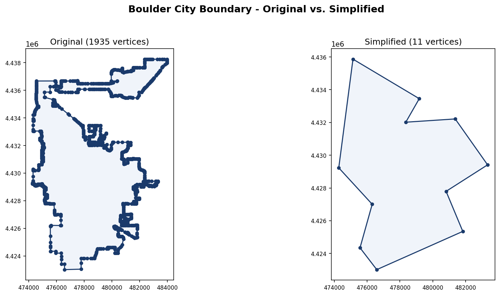

1935-vertex TIGER/Line boundary (left) vs. the Douglas-Peucker simplification after
angle smoothing (right). Vertices with interior angle outside $[0.35\pi,\, 1.75\pi]$
are removed iteratively to prevent SC crowding, leaving an 11-vertex polygon.

### Fig 2 - Streamlines ($\psi = \text{const}$)

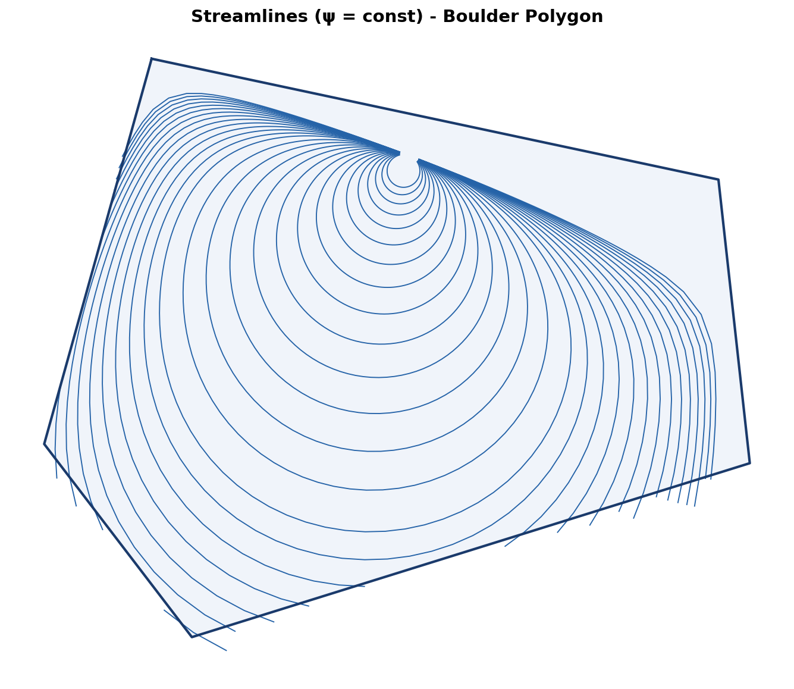

Level curves of the stream function under $W = U\zeta$. Each curve is the forward image
of a horizontal line $\text{Im}(\zeta) = y_0$ in $\mathbb{H}$. Flow enters from the
left and right boundary segments and converges at the top vertex (the conformal image
of $\zeta \to +\infty$).

### Fig 3 - Equipotential Lines ($\varphi = \text{const}$)

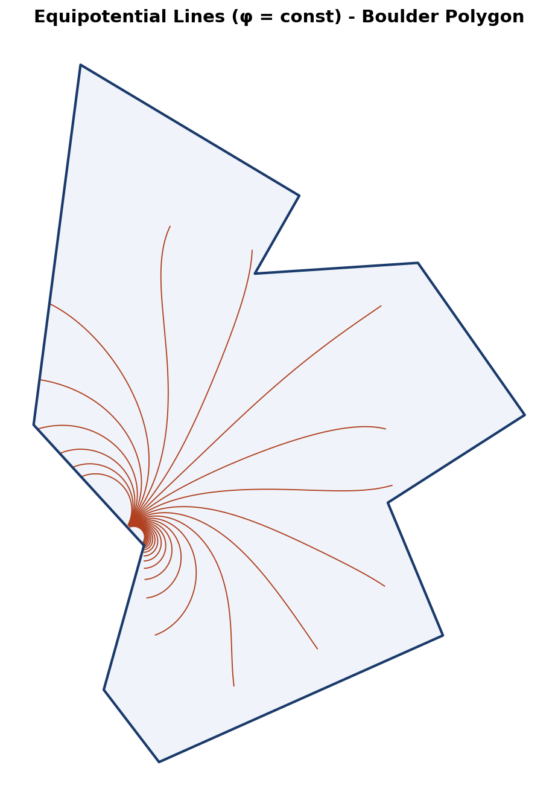

Level curves of the velocity potential $\varphi = \text{Re}(W)$. Each curve is the
forward image of a vertical half-line $\text{Re}(\zeta) = x_0$ in $\mathbb{H}$.

### Fig 4 - Combined Streamlines & Equipotentials

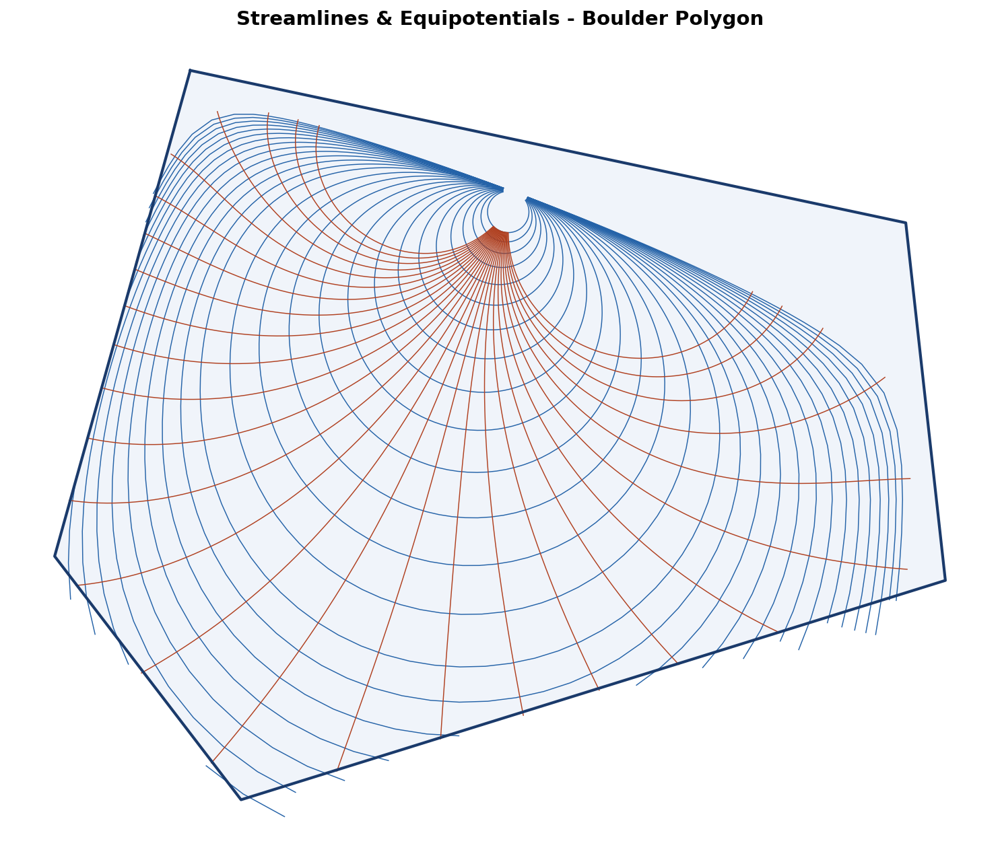

Overlay of Figs 2 and 3 (blue streamlines, red equipotentials). The two families form
the **conformal grid** - the image of a rectangular grid in $\mathbb{H}$ under $f$.
Orthogonality throughout the interior confirms the map is conformal.

### Fig 5 - Terrain-Informed Flow

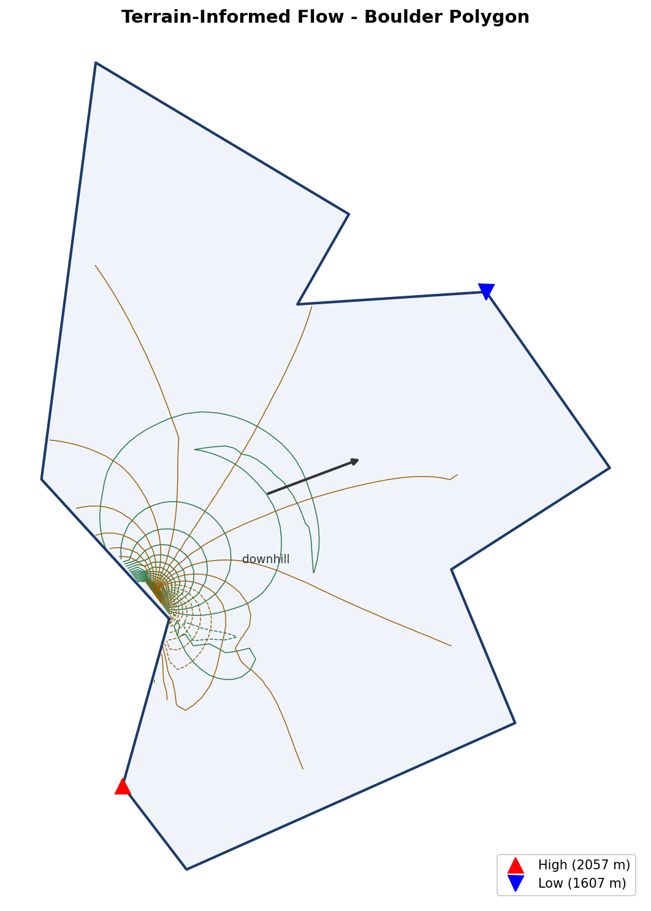

Streamlines (green) and equipotentials (amber) under the terrain-corrected potential.
USGS 3DEP elevation data (81 query points) is fitted with a thin-plate-spline RBF;
the gradient at each polygon vertex drives a source/sink in $\mathbb{H}$. Red triangles
mark the highest vertex (~1770 m, west side); blue triangles the lowest (~1570 m, east).
Streamlines shift visibly toward lower elevation compared to uniform flow.

### Fig 6 - Uniform vs. Terrain-Corrected (side-by-side)

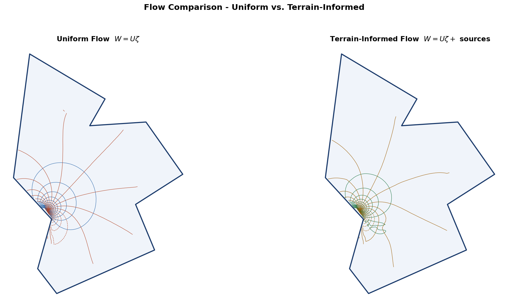

Direct comparison at identical contour levels. The terrain correction bends streamlines
eastward (downhill), reproducing the slope-driven drainage pattern of Boulder's terrain.

### Fig 7 - Urban Core as Interior Obstacle

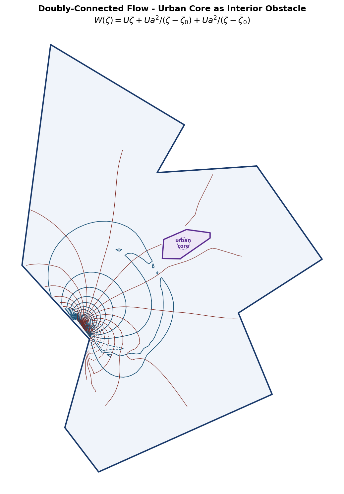

Doubly-connected flow: the downtown commercial core (OSM landuse query, 6-vertex convex
hull, 0.13 km²) is treated as an impenetrable obstacle. Its pre-image in $\mathbb{H}$
is a circle ($\zeta_0$, radius $a$); the Milne-Thomson circle theorem gives
$W = U\zeta + Ua^2/(\zeta-\zeta_0) + Ua^2/(\bar\zeta-\bar\zeta_0)$.
Streamlines visibly deflect around the purple obstacle.

### Fig 8 - Three-Way Comparison

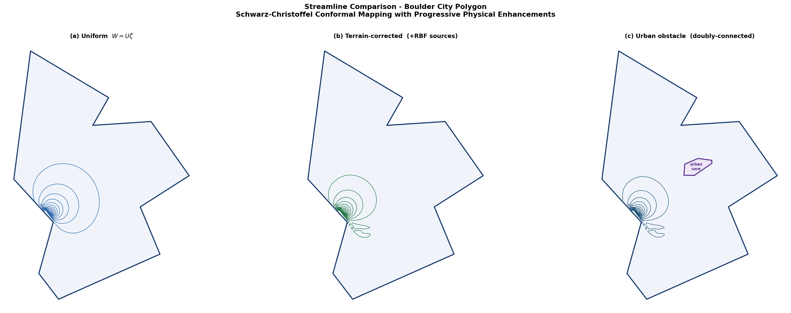

Side-by-side: uniform flow / terrain-corrected / urban obstacle at the same contour
levels. Each panel shows the progressive physical enrichment of the SC framework.

### Fig 9 - Road-Vortex Flow

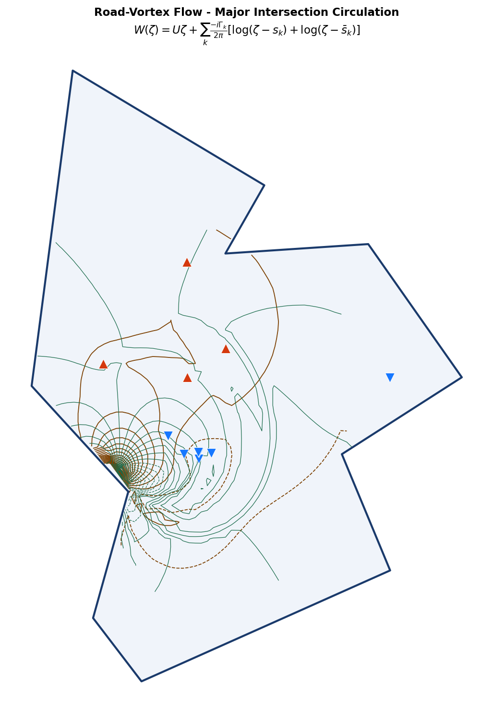

Point vortices placed at the 11 highest-degree OSM road intersections (primary through
tertiary roads) inside the polygon. Each intersection's pre-image in $\mathbb{H}$ is
obtained via the SC inverse map. Vortices north of the centroid spin CCW (orange
triangles), south spin CW (blue triangles), producing a shear pattern consistent with
Boulder's prevailing westerly flow. Streamlines show local eddies at each intersection.

### Fig 10 - Uniform vs. Road-Vortex (side-by-side)

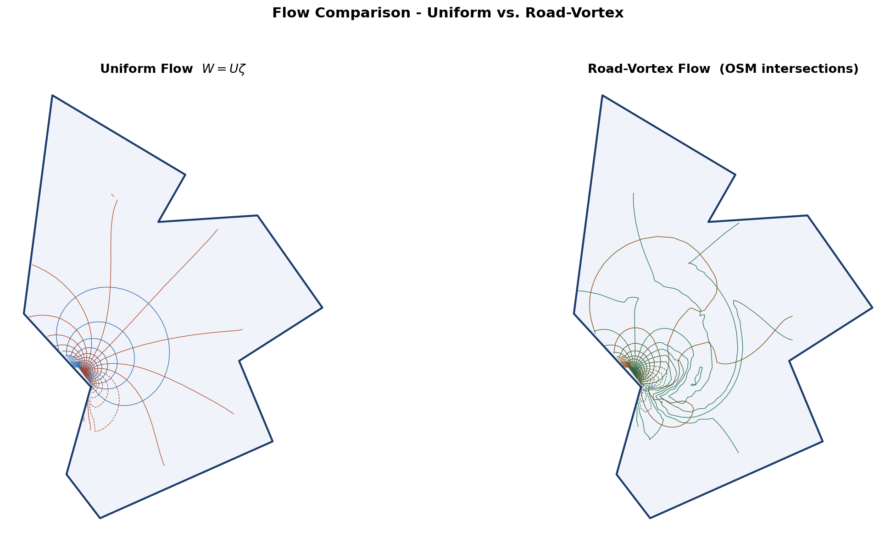

Direct comparison: the road-vortex correction introduces organised local circulation
absent from the uniform baseline, particularly along the Broadway and 28th St corridors.

### Fig 11 - Four-Way Comparison (all models)

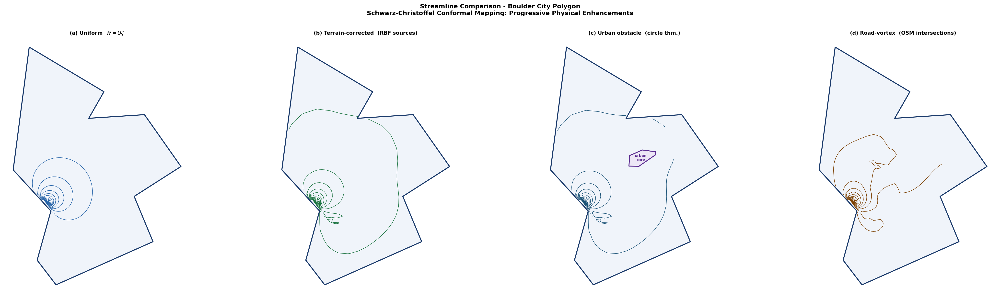

Side-by-side: uniform flow / terrain-corrected / urban obstacle / road-vortex at the same
contour levels. Each panel shows the progressive physical enrichment of the SC framework,
from ideal parallel flow to a doubly-connected, terrain- and circulation-informed model.

---

## Project Structure

```
.
├── data/raw/               TIGER/Line shapefile (Boulder, CO)
├── src/
│   ├── polygon.py          Load, simplify, and smooth Boulder polygon
│   ├── angles.py           Interior-angle computation
│   ├── sc_solver.py        SC parameter problem and forward map
│   ├── flow.py             Forward map, parametric curves, and flow grid
│   ├── terrain.py          DEM elevation (RBF) and per-vertex sources
│   ├── urban.py            Urban-core polygon (OSM) and coordinate conversion
│   ├── roads.py            OSM road intersections → point vortices in ℍ
│   ├── sc_solver_dc.py     Circle-theorem obstacle + combined potentials in ℍ
│   └── visualization.py    Figure generation
├── figures/                Generated output (see above)
├── main.py                 Full pipeline CLI
└── requirements.txt
```

---

## Setup

```bash
python -m venv .venv
source .venv/bin/activate       # macOS / Linux
# .venv\Scripts\activate        # Windows

pip install -r requirements.txt
```

### CLI Options

| Flag | Default | Description |
|------|---------|-------------|
| `--shapefile PATH` | - | TIGER/Line shapefile directory |
| `--demo` | off | Built-in hexagon domain, no data needed |
| `--terrain` | off | Terrain-corrected flow (requires USGS network access) |
| `--urban` | off | Urban-obstacle doubly-connected flow (requires OSMnx) |
| `--urban-method` | `osmnx` | `osmnx` (live OSM) or `fallback` (hardcoded polygon) |
| `--roads` | off | Road-vortex flow from OSM intersection data |
| `--road-method` | `osmnx` | `osmnx` (live OSM) or `fallback` (hardcoded intersections) |
| `--road-n-max` | 12 | Maximum road intersections to use as vortex sources |
| `--grid N` | 80 | Flow-grid resolution (N × N) |
| `--min-vertices` | 12 | Min vertices after Douglas-Peucker |
| `--max-vertices` | 16 | Max vertices after Douglas-Peucker |

---

## References

- Driscoll & Trefethen, *Schwarz-Christoffel Mapping*, Cambridge, 2009.
- Ablowitz & Fokas, *Complex Variables*, Cambridge, 2003.
- Milne-Thomson, *Theoretical Hydrodynamics*, 5th ed., Macmillan, 1968.
- US Census Bureau, TIGER/Line Shapefiles, 2025.
- USGS 3DEP Elevation Point Query Service: https://epqs.nationalmap.gov/v1/
- Boeing, G. (2017). OSMnx. *Computers, Environment and Urban Systems*, 65, 126-139.
